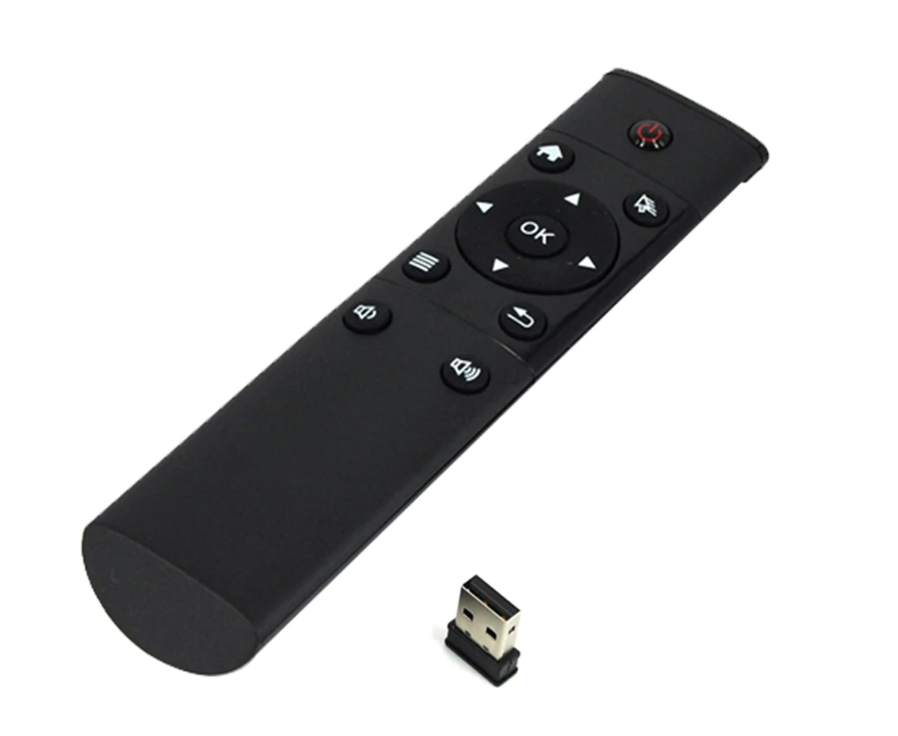

The keybord plugin let you control voluem and playback using a keyboard. While this might not sound too interesting, 
there are many devices that act like a keyboard, e.g. a lot of RF remote controls.
These usually come with a USB dongle that identifies itself as a USB keyboard. A press on the remote control will be
mapped to a specific key.
These remote controls often look like this:


To configure a keyboard or another device that acts like a keyboard, you need to find the correct key codes. While 
these are usually not well-documented, there is a simple helper script that displays these

The script is print-keycodes. It will just output key name and key code of any key you press:

```
up: 103
up: 103
right: 106
right: 106
down: 108
down: 108
esc: 1
esc: 1
help: 115
help: 115
f14: 114
f14: 114
menu: 127
menu: 127
down: 108
down: 108
left: 105
left: 105
```

Now, you can map these keys to commands in the keyboard section:

```
[keyboard]
# Map commands to specific scancodes
volume_up=115
volume_down=114
next=106
previous=105
playpause=28
```
