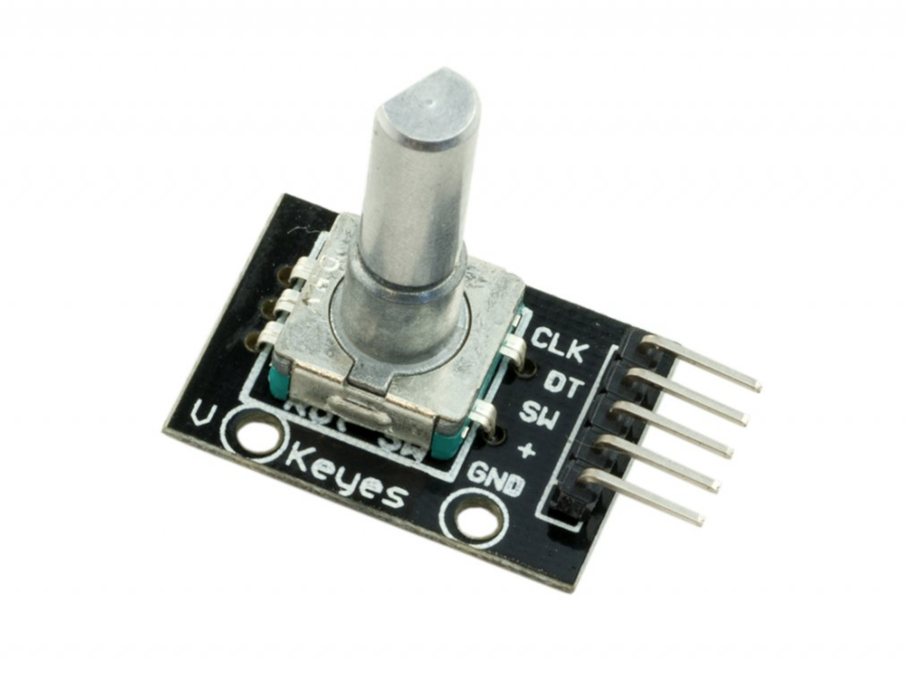
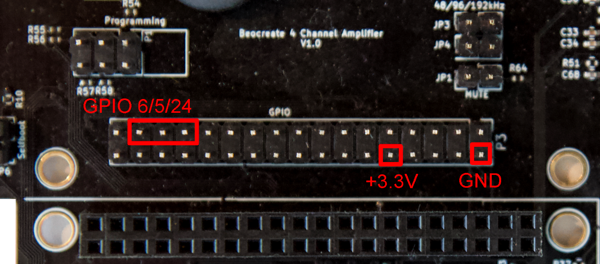

# Using a rotary controller

Rotary controllers are only supported on the Raspberry Pi. You need a rotary controller with integrated pullups to connect it directly to the Raspberry Pi.
There controllers usually have a 5-pin connections:

+ V+
+ GND
+ CLK
+ DATA
+ SWITCH

Usually you will have a small PCB under the rotary controller with some SMD resistors.



V+ will be connected to a 3.3V pin of teh Raspberry Pi (NEVER to 5V!) and GND to a ground pin.The CLK, DATA and SWITCH pins 
need to be connected to an unused GPIO of te Raspberry Pi. You can configure these.

Let's assume a connection to the Beocreate 4 channel amplifier's GPIO as follows:



The configuration for this would look like this:

```[rotary]
clockpin=24
datapin=5
switchpin=6
```
